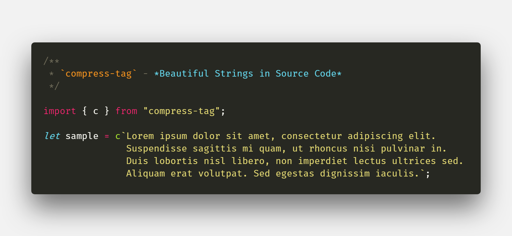

# `compress-tag`

[](https://dev.azure.com/iansan5653/compress-tag/_build/latest?definitionId=2&branchName=master)
[](https://dev.azure.com/iansan5653/compress-tag/_build/latest?definitionId=2&branchName=master)
[](https://dev.azure.com/iansan5653/compress-tag/_build/latest?definitionId=2&branchName=master)
[](https://www.npmjs.com/package/compress-tag)
[](https://david-dm.org/iansan5653/compress-tag)
[](https://david-dm.org/iansan5653/compress-tag?type=dev)



`compress-tag` is a tiny module that enables significantly more readable code by
improving the display of
[string template literals](https://developer.mozilla.org/en-US/docs/Web/JavaScript/Reference/Template_literals)
in your source.

This module provides template literal tags that remove line breaks and indents
from your template literals, so that a string that is formatted to nicely fit in
your code still comes out looking like it should. They are also
[chainable](#Chaining) in case you are already using template literal tags.

In other words, you can replace these:
```js
throw new Error(
  "An error occured while parsing the CSV file. Check that the 'delimiters' option is set properly and try again."
);

const result = prompt(
  "Enter a description to attach to this entry. This should be " +
    "descriptive, but less than 200 characters.",
  "Enter your description here."
);

renderTextContent(`The quick brown fox jumps over the lazy dog. The \
quick brown fox jumps over the lazy dog. The quick brown fox jumps \
over the lazy dog. The quick brown fox jumps over the lazy dog. The \
quick brown fox jumps over the lazy dog.

The quick brown fox jumps over the lazy dog. The quick brown fox \
jumps over the lazy dog. The quick brown fox jumps over the lazy \
dog. The quick brown fox jumps over the lazy dog. The quick brown \
fox jumps over the lazy dog.`);
```

with these:
```js
throw new Error(c`
  An error occured while parsing the CSV file. Check that the
  'delimiters' option is set properly and try again."
`);

const result = prompt(
  c`Enter a description to attach to this entry. This should be
    descriptive, but less than 200 characters.`,
  "Enter your description here."
);

renderTextContent(c`
  The quick brown fox jumps over the lazy dog. The quick brown fox
  jumps over the lazy dog. The quick brown fox jumps over the lazy
  dog. The quick brown fox jumps over the lazy dog. The quick brown
  fox jumps over the lazy dog.\n\n

  The quick brown fox jumps over the lazy dog. The quick brown fox
  jumps over the lazy dog. The quick brown fox jumps over the lazy
  dog. The quick brown fox jumps over the lazy dog. The quick brown
  fox jumps over the lazy dog.
`);
```

## Getting Started

`compress-tag` is a UMD module, so it can be used in Node or on the web. Typings are
included for TypeScript as well.

### Usage in Node.JS

`compress-tag` is hosted on [npm](https://www.npmjs.com/compress-tag), so you
can install with:

```bash
npm i compress-tag
```

To use in code:

```js
import {c, t} from "unraw";

c`Example
  string.` // => Example string.
t`Example
  string.` // => Examplestring.
```

### Usage in the Browser

You can embed it (minified) on a webpage with
[RequireJS](https://requirejs.org/). The module is available on
[UNPKG](https://unpkg.com/compress-tag):

```html
<script src="https://cdnjs.cloudflare.com/ajax/libs/require.js/2.3.6/require.min.js"></script>
<script>
  require(["https://unpkg.com/compress-tag^1.2.0/dist/index.min.js"], 
  function(compressTag) {
    compressTag.c`Example
      string.` // => Example string.
    compressTag.t`Example
      string.` // => Examplestring.
  });
</script>
```

## Documentation

Four template literal tag functions are exported by this module. `compress` and
`c` are exactly the same - they replace your linebreaks and the whitespace
surrounding each line with a single space. `compressTight` and `t` are also the
same - they remove your linebreaks and whitespace with no space.

### Examples

```js
import {compress, c, compressTight, t} from "compress-tag";

let A = compress`Lorem ipsum dolor sit amet, consectetur adipiscing
elit. Suspendisse  sagittis mi quam, ut rhoncus nisi pulvinar in. Duis
lobortis nisl libero, non imperdiet lectus ultrices sed. Aliquam erat
volutpat. Sed egestas dignissim iaculis. Etiam felis risus, tempor ac
dignissim id, vestibulum in mauris. Nam attempus tellus. Aliquam vitae
metus tempor, tempus tellus id, vulputate magna. Vivamus a enim
feugiat, mattis leo in, blandit nunc. Cras faucibus pellentesque
dolor, et euismod mauris sagittis vitae. Quisque egestas metus pretium
mollis tempor.`;
// => Lorem ipsum dolor sit amet, consectetur adipiscing elit. Suspendisse sagittis mi quam, ut rhoncus nisi pulvinar in. Duis lobortis nisl libero, non imperdiet lectus ultrices sed. Aliquam erat volutpat. Sed egestas dignissim iaculis. Etiam felis risus, tempor ac dignissim id, vestibulum in mauris. Nam attempus tellus. Aliquam vitae metus tempor, tempus tellus id, vulputate magna. Vivamus a enim feugiat, mattis leo in, blandit nunc. Cras faucibus pellentesque dolor, et euismod mauris sagittis vitae. Quisque egestas metus pretium mollis tempor.

let B = c`Lorem ipsum dolor sit amet, consectetur adipiscing elit.
Suspendisse sagittis mi quam, ut rhoncus nisi pulvinar in. Duis
lobortis nisl libero, non imperdiet lectus ultrices sed. Aliquam erat
volutpat. Sed egestas dignissim iaculis. Etiam felis risus, tempor ac
dignissim id, vestibulum in mauris. Nam attempus tellus. Aliquam vitae
metus tempor, tempus tellus id, vulputate magna. Vivamus a enim
feugiat, mattis leo in, blandit nunc. Cras faucibus pellentesque
dolor, et euismod mauris sagittis vitae. Quisque egestas metus pretium
mollis tempor.`;
// => Lorem ipsum dolor sit amet, consectetur adipiscing elit. Suspendisse sagittis mi quam, ut rhoncus nisi pulvinar in. Duis lobortis nisl libero, non imperdiet lectus ultrices sed. Aliquam erat volutpat. Sed egestas dignissim iaculis. Etiam felis risus, tempor ac dignissim id, vestibulum in mauris. Nam attempus tellus. Aliquam vitae metus tempor, tempus tellus id, vulputate magna. Vivamus a enim feugiat, mattis leo in, blandit nunc. Cras faucibus pellentesque dolor, et euismod mauris sagittis vitae. Quisque egestas metus pretium mollis tempor.

let C = compressTight`
  <section>
    <h1>Heading</h1>
    <p>This is the content of the section.</p>
    <p>This is another paragraph.</p>
  </section>
`;
// => <section><h1>Heading</h1><p>This is the content of the section.</p><p>This is another paragraph.</p></section>

let D = t`
  <section>
    <h1>Heading</h1>
    <p>This is the content of the section.</p>
    <p>This is another paragraph.</p>
  </section>
`;
// => <section><h1>Heading</h1><p>This is the content of the section.</p><p>This is another paragraph.</p></section>
```

### Preserving Some Linebreaks / Whitespace

You can still output a string that has linebreaks and tabs in it simply by using
the newline (`\n`) and tab (`\t`) characters. For example:

```js
let E = c`This has\n\ta new line`;
// => This has
//     a new line.
```

### Chaining
One drawback to using template literal tags is that they cannot be chained. This
means that if you are already using template literal tags, you can't use these
as described above. However, all of these tags support being used as normal
functions in this case\*:

```js
// Assuming `capitalize` is some other tag that makes every letter uppercase:
let F = c(capitalize`
  Lorem ipsum
  dolor sit amet.
`);
// => LOREM IPSUM DOLOR SIT AMET.
```

\* **Note**: When using tags as a method there is no way to preserve newlines;
using the `\n` character will not work.

### ESLint
Since there is now no reason for your strings to be long, you can modify your
ESLint `max-len` setting to enforce the use of these tags:

*eslintrc.json*
```json
{
  "rules": {
    "max-len": [
      "error",
      {
        "code": 80,
        "ignoreStrings": false,
        "ignoreTemplateLiterals": false,
      }
    ]
  }
}
```

## Contributing

Found a bug or want to see a feature added?
[Submit it here!](https://github.com/iansan5653/compress-tag/issues)

Pull requests are always welcome, although to increase your chances of your
contribution being accepted, opening an issue and linking to it is always a
good idea.

Pull requests will not be merged unless the Azure Pipelines build succeeds. To
quickly confirm that it will, just run:
```bash
npm run check
```
This checks your formatting, tests, and for TypeScript compiler errors. If the
task doesn't fail, you should be good to go.

### Other Tasks
For your convenience, some other tasks are also provided in the `package.json`:
* `npm run build` - Compiles TypeScript code to JavaScript
* `npm run minify` - Generate minified JavaScript files from compiled files
* `npm run test` - Quickly run tests using TypeScript code without compiling
* `npm run testWithCoverage` - Run tests and generate coverage report
* `npm run lint` - Check code for linting errors
* `npm run check` - Check to ensure code will pass Pipelines checks (see above)
* `npm run format` - Format code using Prettier
